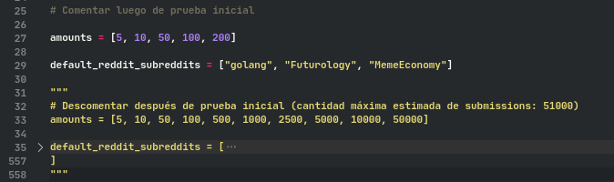

## Por actualizar

## Para obtener datos (Investigación)

## Requisitos

- Python : 3.6.9+
- pip
- Registrarlos como variables de Entorno

### Como agregar Python a variables de entorno en Windows

Tutorial: https://www.youtube.com/watch?v=hX4yh8eLqlE

### Ejecución y prueba inicial

Nota: Según instalación se pueden requerir las siguientes modificaciones en los comandos:

- `python` por `python3`
- `pip` por `pip3`

#### Sin entorno virtual

```bash
cd ./gpi-api ## Situarse en carpeta
pip install -r requirements.txt ## Instalación (global) de dependencias
python src/check_reddit.py ## Ejecución
```

#### Usando pipenv

```bash
cd ./gpi-api ## Situarse en carpeta
pipenv shell ## Creación de entorno virtual
pipenv install ## Instalar dependencias desde Pipfile
python src/check_reddit.py ## Ejecución
```

### Prueba real

Aplicar las siguientes modificaciones y ejecutar nuevamente



---

## Instalación y Ejecución (Desarrollo)

Requisitos

- Python : 3.6.9+

Instalar Pipenv

```bash
pip install pipenv
```

Crear entorno virtual

```bash
pipenv shell
```

Instalar dependencias

```bash
pipenv install
```

Ejecutar

```bash
python src/main.py
```
